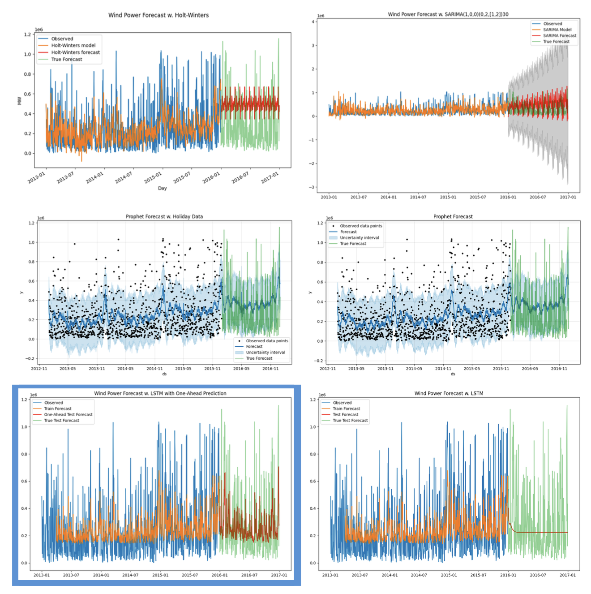

# Time Series Analysis of Wind Power Production

## Data

The main data of this project is the wind power production data, from a power station in Germany, available on [Kaggle](https://www.kaggle.com/datasets/l3llff/wind-power?resource=download). 

The exogenous data we decided to use is the weather data from a weather station in the same region, also available on [European Union Data](https://data.europa.eu/data/datasets/c53352bf-1a65-46f3-a5dc-d35fe0c7f965?locale=en).

## Objective

The main objective of this project is to analyze the wind power production data and try to predict the power production using the weather data as exogenous variables, to see if the weather data can help to predict the wind power production.

## Methodology

For our analysis, we will fit, predict and evaluate multiple models as seen in the course and found in our research. We will use the following models for our original data:

- SARIMA
- Holt-Winters
- Prophet (w. additional holiday regressors)
- LSTM

And compare the results of these models to the results of the following models with the exogenous data:

- SARIMAX
- Prophet (w. additional holiday regressors)
- LSTM

For our LSTM models, we will consider 2 different approaches to prediction:

- Blind prediction: we will predict the next year of values, the same way we did for the other models. We will not expose the model to any testing data, and insert the model's predictions back into the model as input for the next prediction.

- One-Ahead prediction: based on the domain, we determine that the model should be able to predict the next day's power production based on the weather forecast for the following day (since it is reasonable to take a weather forecast one day ahead as an estimation of the actual weather). This model will predict only a day ahead and then be fed the actual data for the next day to predict the following day, so it is not comparable to the other models.

## Results

We used the RMSE as our main metric to evaluate the models. The results are shown in the table below:

| Model | RMSE |
| --- | --- |
| SARIMA | 430256.69 |
| Prophet | 251773.99 |
| Prophet w. Holidays | 251658.54 |
| Holt-Winters | 326736.26 |
| LSTM | 241413.05 |
| **With additional exogenous data:** |
| SARIMAX | 420226.4 |
| Prophet | 453538.62 |
| LSTM | 229313.26 |

### One-Ahead LSTM Models:
| Model | RMSE |
| --- | --- |
| LSTM | 213051 |
| LSTM w. Exog | 209772 |

The predictions can be seen in the following graphs:

### Initial Models' Predictions:

### Exogenous Models' Predictions:

**Note: the one-ahead LSTM model is marked in the graphs with a different color.**

For more detailed results and explanations, please refer to the notebook.

## Conclusion

We have presented the results of our analysis and the comparison between the models. The LSTM model with exogenous data was the best model, demonstrating the importance of the weather data in predicting the wind power production. 

However, we found that predicting a large number of steps ahead does not guarantee great results, and we recommend using the one-ahead prediction model we developed for this specific case.

We also note that the series is very noisy and has a lot of variance, which makes it hard to predict. We recommend further analysis of the 15-minute increments data, instead of daily data, to see if the results improve.